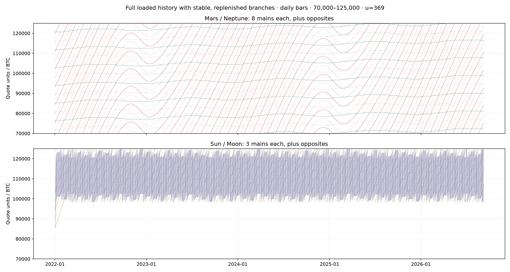
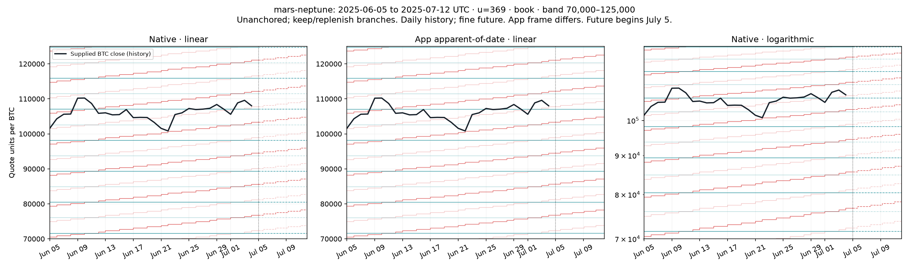
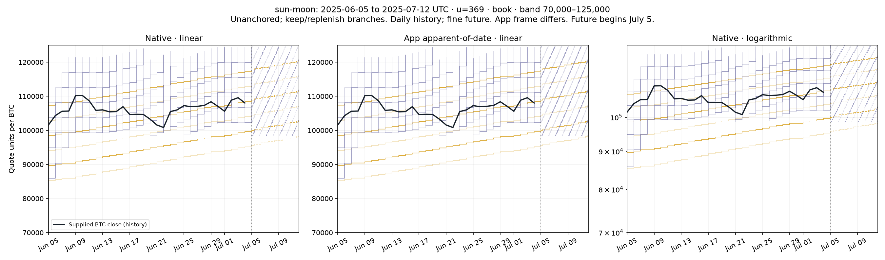
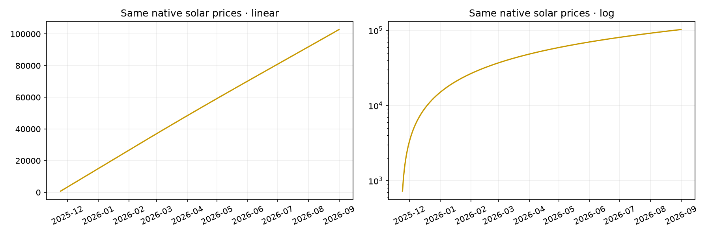

# Native Pine: full historical coverage and per-body replenishment

This revision implements the user's clarified behavior: retain per-planet counts, keep trajectories inside each chosen price bracket, and replenish a branch when it exits. It supersedes the earlier finite-history polyline design.

## What changed

- **All loaded history:** removed Historical render days and `calc_bars_count=3000`. The chart's loaded bars, Display start/end and the 2009–2050 model interval determine historical coverage. No rolling 360/365-day replacement limit was introduced.
- **Stable branch families:** initialize a contiguous family near the price-bracket midpoint. Keep each valid `(body,k,opposite)` in its existing slot. Fill a vacancy with an eligible adjacent k; if both sides fit, prefer the one nearer the midpoint. A still-valid line is never displaced just because its price rank changes.
- **Counts retained:** each body's 0–12 requested mains remain an upper bound inside its bracket. Each side displays `min(requested, eligible)` sampled levels. Opposites are counted separately and add up to the same count. Invalid ranges are rejected. Narrow bands cannot fabricate closer spacing.
- **Plot-based history:** a pool of 32 historical plots consumes 64 plot counts, including series colors. Identity changes hide the incoming connector. This permits unlimited loaded-history duration without allocating a drawing per historical branch.
- **Future continuity:** future paths start from a copy of the confirmed historical allocation and run the same replenish function. They cannot mutate historical identities or contact state. Drawing/sample budgets apply only to future projections.
- **Contacts:** a surviving branch retains its own state; replacements/reset entries start fresh. The dashboard remains removed; native orbital functions, exact price arithmetic and causal session logic are unchanged.

The initial family can depend on how much earlier history TradingView loads. This is the consequence of honoring branch survival. The price of any specified `(timestamp,body,k,side)` is invariant. Selection depends on astronomy and the configured bracket, never the Bitcoin close.

## Rendering limits and placement

The simultaneous request must satisfy `sum(enabled main counts) * (opposites ? 2 : 1) <= 32`. All ten bodies at one main each plus opposites fit (20). Mars and Neptune at eight each plus opposites fit (32). One body at twelve plus opposites fits (24). An oversized selection raises an explicit error; split body selections across indicator instances if needed. This is a curve-count limit, not a day limit. [Official plot counting](https://www.tradingview.com/pine-script-docs/visuals/plots/#plot-count-limit).

Historical resolution now follows chart bars, as in the earlier plot-based implementation. Daily lunar book-mode plots have daily step timing; finer history needs a shorter chart timeframe. A new identity is numerically allocated on its replacement bar, but its incoming connector is hidden with `na` color; its visible line begins with the next sample. No connector joins different k values. This uses Pine's documented conditional-color pattern, not an unverified polyline NaN-gap assumption. [Conditional plot colors](https://www.tradingview.com/pine-script-docs/visuals/plots/#color-control).

Bar-open mode is placed at `time`. Confirmed-close plots use `time_close` prices with a one-bar offset. This is exact on contiguous time-based Bitcoin bars, where next open equals prior close; on missing/session bars Pine places the value at the next chart bar, potentially later. This limitation is explicit in the usage docs. Future polylines retain exact timestamps and the confirmed endpoint. [Plot offsets](https://www.tradingview.com/pine-script-docs/visuals/plots/#offsets).

Future limits remain 96 segments, 6,000 body samples, 40,000 total vertices and 9,500 per path. All future paths are planned/checked before drawing; old owned drawings are deleted before replacement. Historical duration never enters these budgets. Optional labels/boxes/lines stay below their declared object counts. Pine execution-time and rollback behavior still require platform testing.

## Multi-year resource evidence

Each following fixture covers **January 1, 2009–September 1, 2026 at daily bars**, followed by seven future days. The independent planner and actual extracted allocation/future-builder bodies produce identical identities and points. Historical segments in this table are conceptual path identities, **not drawing objects**.

| Fixture | Loaded bars | Historical segments | Allocated plot curves | Future segments | Future body samples | Future vertices |
| --- | ---: | ---: | ---: | ---: | ---: | ---: |
| default_nine_full_history | 6453 | 659 | 18 | 18 | 320 | 1262 |
| all_ten_full_history | 6453 | 2859 | 20 | 24 | 798 | 3168 |
| dense_mars_neptune | 6453 | 343 | 32 | 25 | 58 | 1397 |
| sun_moon_full_history | 6453 | 7618 | 12 | 21 | 510 | 6099 |

All configurations compile to the same 32 calls / 64 plot-count budget regardless of which slots are used. The historical Moon fixture traverses many revolutions and thousands of branch identities without consuming thousands of polylines. Budget errors and source contact-state reset behavior have regression checks. Counts, exact bounds, negative rounding ties, anchors, direct/retrograde motion, zero counts, twelve mains, custom ranges, narrow brackets and surviving-slot invariance are tested.

## 120-day future horizon

The earlier 120-day extension was validated as follows; the current input maximum is **700** (default remains 7). History, allocation, resolution and safety budgets are unchanged. The following source-executed fixtures start at September 1, 2026 and reach **December 30, 2026**, exactly 120 days later, for every selected body:

| Configuration | Future segments | Body samples | Vertices |
| --- | ---: | ---: | ---: |
| Default nine bodies, one main plus opposite each | 29 | 5338 | 21323 |
| Mars/Neptune, eight mains plus opposites each | 30 | 962 | 24112 |

The optional Moon can exceed the existing sample budget at this horizon; the indicator keeps its explicit resource errors rather than silently reducing resolution or truncating the forecast. Display end and model validity can also shorten the endpoint.

## 700-day future horizon

The Future days input now accepts **0–700**, with its 7-day default retained. No astronomical, historical-rendering or allocation formulas changed. Existing future budgets remain enforced. Two source-executed scenarios reach the full 700-day endpoint for every selected body:

| Configuration | Endpoint from September 1, 2026 | Future segments | Body samples | Vertices |
| --- | --- | ---: | ---: | ---: |
| Sun: one main plus opposite | 2028-08-01 | 22 | 3082 | 12306 |
| Mars/Neptune: one main plus opposite each | 2028-08-01 | 13 | 5602 | 22395 |

Use Custom body selection for those scenarios. The default nine-body configuration and configurations including Moon exceed the existing sample budget at 700 days; select fewer bodies or a shorter horizon. No curve is silently dropped or coarsened. Display end and model validity remain endpoint bounds. Pine compilation/runtime remain unverified.

## Visual fixtures

The following headless figure uses **2022-01-01–2026-09-08**, daily historical samples, unit 369, book rounding and a 70,000–125,000 bracket. The upper panel uses Mars/Neptune counts 8/8; the lower uses Sun/Moon 3/3. Opposites are enabled. This demonstrates the extended historical families, rather than clipping the last year. When the count is smaller than the number that can fit, the family occupies only part of the bracket; that follows the requested count limit.



The shorter figures use a common explicit June 5–July 12, 2025 interval and a July 5 historical/future split. The dark line is the supplied repository BTC close data, available through July 4. No future market prices are invented. Historical samples are daily; future samples use the finer body-dependent cap. The app panel uses actual headless `workspace.calculate` output with the same keep/replenish selection policy applied for comparison; it does not claim that the app itself has those count controls.





The supplied `output.png`, `output2.png` and `webapp.png` do not expose sufficient metadata to establish matching dates, scales or counts. These fixtures state their own assumptions, rather than pretend to be pixel-exact reproductions. The multi-year Mars/Neptune family provides the intended visual comparison with `webapp.png`.

## Astronomy, price arithmetic and original diagnosis

No orbital coefficients, canonical winding, geocentric transformation or scaling formula were changed. Native mode remains geometric mean ecliptic/equinox of date; the app defaults to apparent-of-date. The previous frame-matched 2009–2050 independent sweep comprised 15,345 timestamps per body (153,450 comparisons). Source-derived fixtures continue to pass after the renderer change; the complete recorded matching-frame maximum/RMS errors are unchanged:

| Body | Maximum longitude error ° | RMS error ° |
| --- | ---: | ---: |
| Sun | 0.009068 | 0.003315 |
| Mercury | 0.013672 | 0.003590 |
| Venus | 0.029348 | 0.004888 |
| Mars | 0.055965 | 0.008526 |
| Jupiter | 0.029939 | 0.007748 |
| Saturn | 0.048228 | 0.017515 |
| Uranus | 0.025069 | 0.015987 |
| Neptune | 0.020447 | 0.009501 |
| Pluto | 0.018692 | 0.008889 |
| Moon | 0.090104 | 0.026507 |

The current source-derived helper also regenerated the actual-app comparison CSV: June 5–July 5, 2025 UTC, 121 six-hour timestamps × ten bodies × two sides. Rows record wrapped/canonical longitude, speed, rounded coordinate, k/opposite, matching-frame reference and actual app level price. Winding alignment remains `L_native≈L_app+360*m`, `k_app=k_native+15*m`.

The exact formulas remain `P=(anchored?P0:0)+u*(Q-(anchored?L0:0)+24*k)` and `O=P+12*u`, where `Q=floor(L+0.5)` or continuous L. Adjacent mains differ by 8,856 and opposites by 4,428 at u=369. Parallel identities share the same shape and additive offsets. No fit to Bitcoin, exponential price transform or change in orbital speed was introduced.

The original fixed-reference diagnostic remains reproducible: Sun center price 102,951 at September 1, 2026 but 369 on November 23, 2025; Moon 97,785 at reference but 3,321 on August 12; Mars 99,999 at reference but 1,845 on September 2, 2025. Including September 1 gives an earlier Mars value of 1,476. Neptune remains near the band, with reference 98,892 and sampled minimum positive 97,047. These are diagnostic outputs, not indicator constants.

The old fixed branch set explains lost fast-body coverage. Log scaling and scale attachment can additionally alter appearance, but are only hypotheses for the cropped screenshots. The script shares the price scale for a new overlay instance and never distorts prices to compensate for log mode. Compare the same numerical solar prices on both axes:



The full numerical outputs are [correction-numerics.json](correction-numerics.json), [correction-comparison.csv](correction-comparison.csv) and [accuracy.json](accuracy.json). Future interpolation measurements at quarter/mid/three-quarter samples in 2024–2026 remain in the JSON. They are empirical smooth-error measurements, not claims that sampled book transitions are exact. Monthly Moon remains explicitly rejected.

## Verification and reproduction

Source-derived tests execute `f_replenish`, the contact reset block, the historical connector predicate, and `f_build_paths`/`f_queue`/`f_vertex` with timestamp/price drawing stubs. The planner uses a separate set-allocation implementation. Tests check that every eligible survivor keeps its slot, active counts equal the number requested/available, selected k values remain contiguous, branches stay in their bands and future planning leaves the seed untouched. A daily 2009–2026 test explicitly exceeds both the old 365-day and 3,000-bar restrictions.

```sh
python -m pytest tests/test_bitcoin_native_pine.py tests/test_bitcoin_native_correction.py tests/test_universal_geometry.py tests/test_universal_events.py tests/test_universal_market.py tests/test_universal_book.py -q
MPLCONFIGDIR=/tmp/native-pine-mpl python tools/native_pine/correction_report.py
python tools/native_pine/render_check.py
```

Plot/reference development dependencies in this workspace are under `/tmp/bitcoin-native-reference`; the report helper ran with `PYTHONPATH=/tmp/bitcoin-native-reference .venv/bin/python`. They are not runtime dependencies of the indicator. The application was not launched or modified.

**Unverified platform behavior:** no authorized Pine compiler/runtime is available here. These checks do not establish Pine qualifier correctness, execution time, actual plot styling, rollback or live alert delivery. Remaining platform checks are to compile/add a fresh instance, verify scale attachment, load multiple years, enable Moon, exercise the dense Mars/Neptune preset and an over-capacity selection, and inspect replacement gaps/confirmed-close placement on the actual chart. See [validation.md](validation.md) for the executed test result.
